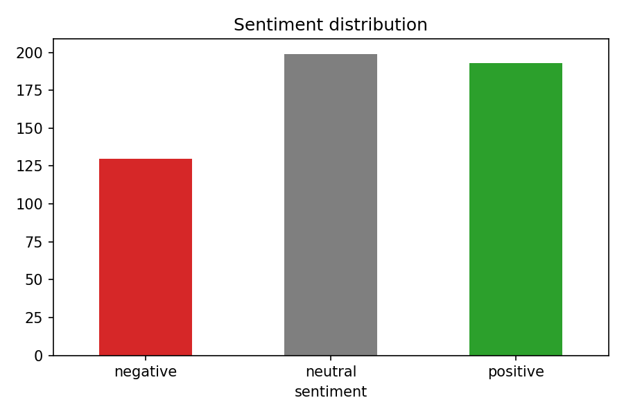
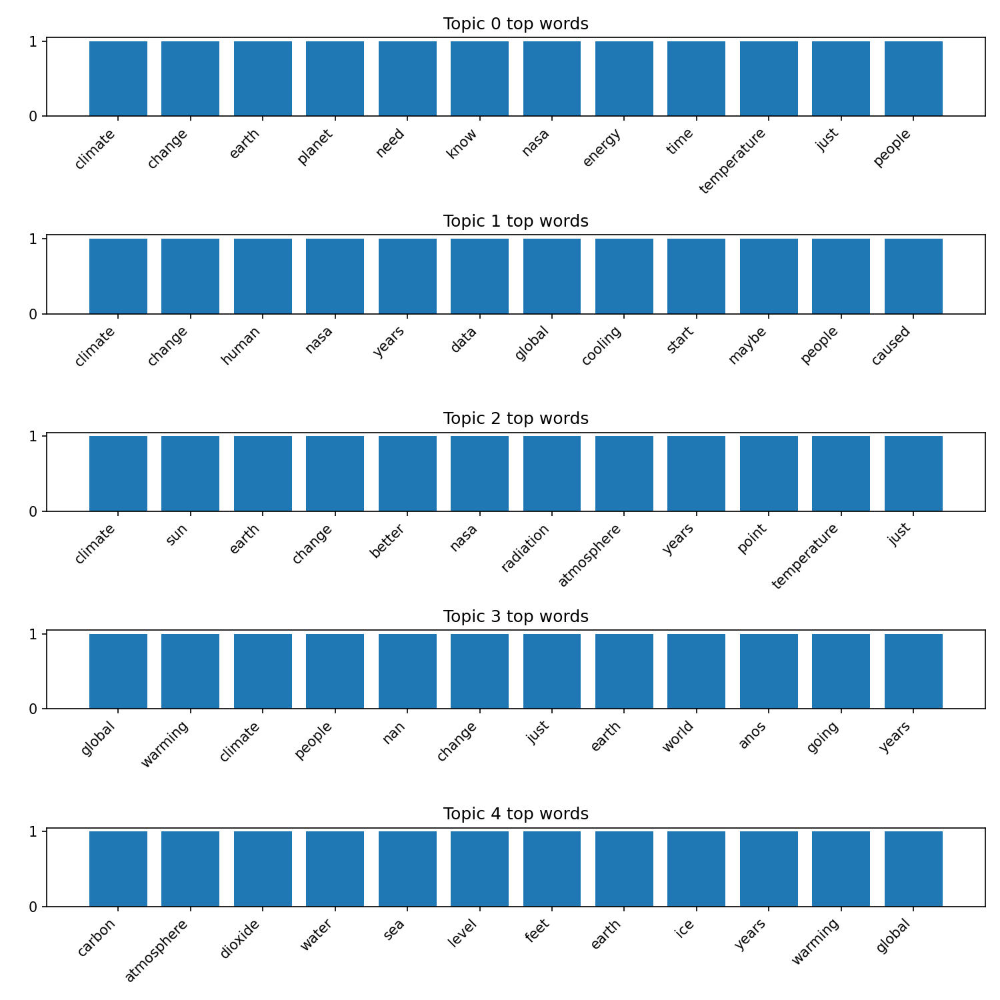

## 🌎 Climate Change Modeling — NASA Facebook Comments (NLP)

Analyze public discourse around climate change using a curated dataset of NASA Climate Change Facebook comments. This repo includes a Jupyter notebook that performs:
- 💬 Sentiment analysis (VADER)
- 📈 Trend analysis over time
- 🎯 Engagement analysis (likes/replies vs sentiment/text length)
- 🧩 Topic modeling (LDA)

### Project Contents
- `Climate_Comments_Analysis.ipynb` — main analysis notebook
- `climate_nasa.csv` — dataset of comments (date, likesCount, profileName, commentsCount, text)
- `climate_comments_enriched.csv`
- `sentiment_distribution.png` 📊
- `topics_top_words.png` 🧠

### 🔍 Preview

Sentiment distribution



Top words per topic



### Dataset
Over 500 user comments collected from high-performing posts on NASA’s Facebook page dedicated to climate change (`https://web.facebook.com/NASAClimateChange/`). Columns:
- `date` (ISO datetime)
- `likesCount` (int)
- `profileName` (SHA-256 hash; anonymized)
- `commentsCount` (int)
- `text` (comment body)

Ethics and privacy: profile identifiers are hashed (SHA‑256) per the brief to preserve privacy while enabling aggregate analysis.

### ⚡ Quickstart
Prerequisites:
- Python 3.9+ recommended
- Jupyter (or VS Code with the Jupyter extension)

Run the analysis:
```bash
# Option A: Jupyter Lab/Notebook
jupyter lab
# or
jupyter notebook
```
Open `Climate_Comments_Analysis.ipynb` and “Run All”. The first cell will install any missing Python packages (pandas, numpy, matplotlib, seaborn, nltk, scikit-learn) and download the VADER lexicon.

Outputs are written to:
- `climate_comments_enriched.csv`
- `sentiment_distribution.png`
- `topics_top_words.png`

### 🧪 What the Notebook Does
- 🧼 Cleans and types columns (`date`, numeric fields, normalized text)
- 🧭 Computes VADER sentiment (`neg`, `neu`, `pos`, `compound`) and sentiment classes
- 📅 Aggregates monthly trends: average sentiment, comment volume, average likes/replies
- 🤝 Explores engagement vs sentiment and text length
- 🧠 Fits a 5-topic LDA model and assigns each comment a dominant topic

### 🔧 Configuration
You can tweak these in the topic modeling cell:
- `NUM_TOPICS` (default: 5)
- `MAX_FEATURES` for `CountVectorizer`
- Stopword handling/token pattern

### ♻️ Repro Tips
- If plots don’t render, ensure the notebook is run in a kernel with GUI/inline backend enabled.
- If package installs fail in-notebook, preinstall manually:
```bash
pip install pandas numpy matplotlib seaborn nltk scikit-learn
python -c "import nltk; nltk.download('vader_lexicon')"

```
